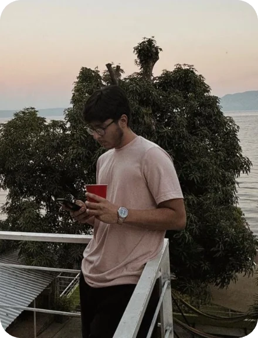

<div align="center">


<a href="https://github.com/flcruz0310-netizen">
  
</a>

</div>

<br />

<table>
<tr>
<td width="62%" valign="top">

### 👋 Hola, soy Isaac

Desarrollador **frontend** y estudiante de ingeniería en **El Salvador**. Diseño y construyo interfaces **modernas, rápidas y responsivas**, convirtiendo ideas y diseños en experiencias digitales enfocadas en el usuario.

Me importa cada detalle: **jerarquía clara**, **HTML semántico**, **CSS escalable**, **JavaScript modular** y animaciones que guían la atención sin sacrificar rendimiento.

- 🚀 Ahora mismo: **Bootcamp Frontend** en Kodigo Academy
- 🧩 Certificándome en **Scrum Developer (SDPC™)** con Certiprof
- ✨ Explorando **GSAP** y **Three.js** para interfaces con movimiento
- 💬 ¿Tienes una idea? **Hablemos** 👇

</td>
<td width="38%" align="center" valign="top">



</td>
</tr>
</table>

---

### 🧑‍💻 `isaac.config.js`

```js
const isaac = {
  rol: 'Frontend dev',
  base: 'San Salvador, El Salvador',
  stack: ['HTML', 'CSS', 'JavaScript', 'React'],
  motion: ['GSAP', 'Three.js'],
  principios: ['diseño con intención', 'código limpio', 'responsive desde el inicio'],
  disponible: true,
};
// De una idea a una interfaz.
```

---

### 🛠️ Stack

<p align="left">
  <a href="https://skillicons.dev">
    
  </a>
</p>

---

### 🌅 Proyecto destacado

<table>
<tr>
<td>

#### [Monarca Village](https://monarcavillage.com/) &nbsp; 

Sitio para **seis apartamentos frente a la playa El Amatal**, en La Libertad, El Salvador. Diseño editorial inspirado en la calma del lugar, con navegación intuitiva que guía al visitante hasta su reserva.

| | |
|---|---|
| 🗂️ **Multipágina** | Inicio, Apartamentos, Galería y Contacto |
| 🌐 **Bilingüe** | Español / inglés con un solo clic |
| 🖼️ **Galería con filtros** | Fotos organizadas por categoría |
| 💬 **Reservas por WhatsApp** | Mensaje listo para enviar |
| 📱 **Responsive** | Del móvil al escritorio, imágenes optimizadas |


<a href="https://monarcavillage.com/"></a>

</td>
</tr>
</table>

---

### 🎓 Formación

| | Programa | Estado |
|:-:|---|:-:|
| 💻 | **Desarrollador Front-end web** — [Kodigo Academy](https://info.kodigo.org/pensum-web-frontend-2026)<br><sub>HTML · CSS · JavaScript · Bootstrap · Git/GitHub · React (componentes, hooks, Context API, APIs)</sub> | 🟡 En proceso |
| 🏅 | **Scrum Developer Professional Certification (SDPC™)** — [Certiprof](https://certiprof.com/es/collections/public/products/scrum-developer-professional-certification-sdpc)<br><sub>Sprints, backlogs, trabajo en progreso y entrega continua de valor</sub> | 🟡 En proceso |
| 🛠️ | **Ingeniería** — Universidad Dr. José Matías Delgado | 🟡 En curso |

---

### ⚙️ Cómo trabajo

> **🎯 Diseño con intención** — Jerarquía clara, tipografía cuidada y espacio para respirar. Cada decisión visual tiene un porqué.
>
> **🧼 Código limpio** — HTML semántico, CSS escalable y JavaScript modular. Fácil de leer, mantener y hacer crecer.
>
> **🌀 Movimiento con propósito** — Animaciones con GSAP y escenas 3D con Three.js que guían la atención, sin sacrificar rendimiento.
>
> **📱 Responsive desde el inicio** — Del móvil al escritorio, con la misma calidad en cada pantalla.

---

<div align="center">

### 🤝 ¿Construimos algo juntos?

<a href="mailto:flcruz0310@gmail.com"></a>
<a href="https://wa.me/50379475032"></a>

<br /><br />


</div>
